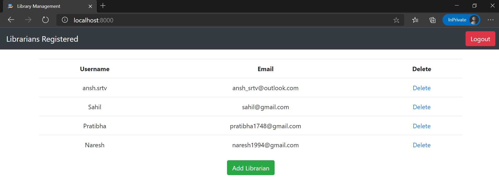

# Library Management
A library management software where admin can add/view/delete librarians and librarian can add/update/delete students and add/view books, issue, view issued books and return books. 

<!-- ### Admin Credentials for [live demo](http://ec2-15-207-249-218.ap-south-1.compute.amazonaws.com:3000)
* Username: admin
* Password: bOOK.lov3r
-->

## Setup & Run:
1. Clone the repository `git clone https://github.com/anshsrtv/library_mgmt.git`
1. Enter the repository `cd library_mgmt/`
1. Install **Python3**:
    1. linux(ubuntu/debian) - sudo apt install python3
    1. windows - Download installer from https://www.python.org/downloads/release/python-370/.
1. Install **MySQL**, for Ubuntu/WSL, check [this](https://www.digitalocean.com/community/tutorials/how-to-create-a-django-app-and-connect-it-to-a-database): 
    1. `sudo apt install mysql-server`
    1. `sudo apt install python3-dev`
    1. `sudo apt install python3-dev libmysqlclient-dev default-libmysqlclient-dev`
1. Log into MySQL `sudo mysql -u root`
    1. mysql> `CREATE DATABASE library;`
    1. mysql> `CREATE USER 'admin'@'%' IDENTIFIED WITH mysql_native_password BY 'admin@123';`
    1. mysql> `GRANT ALL ON library.* TO 'admin'@'%';`
    1. mysql> `FLUSH PRIVILEGES;`
1. Create a virtual environment with python3 `python3 -m venv env`
1. Activate it `source env/bin/activate`
1. Install all the requirements `pip install -r requirements.txt`
1. Migrate the migrations: `python manage.py migrate`
1. Create a superuser `python manage.py createsuperuser` and enter the required credentials.
1. Run the app: `python manage.py runserver`
1. Navigate to http://localhost:8000 in your browser
1. To create an admin, navigate to http://localhost:8000/admin/:
    1. Select Profiles Table.
    1. Click Add Profile.
    1. Select the User and User type as **Admin** and click Save.
1. Now, the admin can add librarians using the application views as shown [below](#views) .
1. When you are done using the app, deactivate the virtual environment: `deactivate`

## Views:
1. **The first page when you enter the url is Login View:**
    
1. **Admin View:**
    
1. **To add a librarian, register with username & password here:**
    
1. **When you logout, you get back the login page. Login with the username and password of a librarian and you get:**
    
1. **Add/Update Students here:**
    
1. **Add/Update Books here:**
    
1. **Issue Books here:**
    
1. **View Issued Books here:**
    

